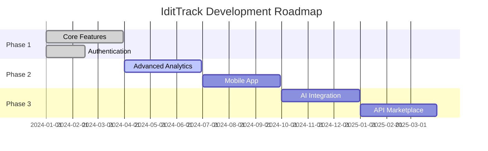

<div align="center">

# 📦 IditTrack
### *Your Intelligent Inventory & Order Management Solution*


[](https://reactjs.org/)
[](https://www.typescriptlang.org/)
[](https://supabase.com/)
[](https://tailwindcss.com/)
[](https://web.dev/progressive-web-apps/)


</div>

---

## 🚀 What is IditTrack?

**IditTrack** is a cutting-edge, full-stack inventory and order management system designed for modern businesses. Built with the latest web technologies, it provides real-time tracking, seamless user experience, and powerful administrative controls.

<div align="center">

</div>

### 🎯 Perfect For
- 🏪 **Small to Medium Businesses**
- 📦 **E-commerce Stores** 
- 🏭 **Warehouse Management**
- 📊 **Inventory Optimization**
- 🛒 **Order Processing**

---

## ✨ Key Features

<table>
<tr>
<td width="50%">

### 🔐 **Authentication & Security**
- 🔑 Secure user authentication
- 👥 Role-based access control (Admin/Manager/User)
- 🛡️ Row Level Security (RLS)
- 📧 Email verification
- 🔒 Protected routes

### 📦 **Inventory Management** 
- 📊 Real-time stock tracking
- 🏷️ Product categorization
- 📈 Stock level monitoring
- ⚠️ Low stock alerts
- 🔄 Multi-location support

</td>
<td width="50%">

### 🛒 **Order Management**
- 📝 Order creation & tracking
- 📋 Order status management
- 💰 Pricing & billing
- 📦 Shipping management
- 📊 Order analytics

### 👑 **Admin Features**
- 👥 User management
- 📊 Analytics dashboard
- ⚙️ System configuration
- 🔧 Database management
- 📈 Performance monitoring

</td>
</tr>
</table>

---

## 🛠️ Tech Stack

<div align="center">

| Frontend | Backend | Database | Tools |
|:--------:|:-------:|:--------:|:-----:|
|  |  |  |  |
|  |  |  |  |
|  |  |  |  |
|  |  |  |  |

</div>

---

## 🚀 Quick Start Guide

### 📋 Prerequisites

```bash
# Node.js (v18 or higher)
node --version

# npm or yarn
npm --version
```

<div align="center">

</div>

### 🗄️ Database Setup

<details>
<summary>🔽 Click to expand database setup instructions</summary>

1. **Create a Supabase Project**
   ```bash
   # Visit: https://supabase.com/dashboard
   # Create new project
   ```

2. **Run the Database Script**
   ```sql
   -- Open Supabase SQL Editor
   -- Copy & paste entire contents of database-complete.sql
   -- Execute the script ✨
   ```

3. **Verify Setup**
   ```sql
   -- Check if tables are created
   SELECT table_name FROM information_schema.tables 
   WHERE table_schema = 'public';
   ```

</details>

### 🎯 Application Setup

```bash
# 1️⃣ Clone the repository
git clone https://github.com/viditkulsh/idittrack.git
cd idittrack

# 2️⃣ Install dependencies
npm install

# 3️⃣ Setup environment variables
cp .env.example .env.local
# Edit .env.local with your Supabase credentials

# 4️⃣ Start development server
npm run dev
```

<div align="center">

</div>

### 🌍 Environment Variables

```env
VITE_SUPABASE_URL=your_supabase_project_url
VITE_SUPABASE_ANON_KEY=your_supabase_anon_key
```

---

## 📱 Application Structure

```
📦 IditTrack/
├── 🗄️ database-complete.sql          # Single comprehensive DB setup
├── 📱 src/
│   ├── 🧩 components/               # Reusable UI components
│   │   ├── Navbar.tsx              # Navigation component
│   │   └── ProtectedRoute.tsx      # Route protection
│   ├── 🎭 contexts/                # React contexts
│   │   └── AuthContext.tsx         # Authentication context
│   ├── 🪝 hooks/                   # Custom React hooks
│   │   ├── useDatabase.ts          # Database operations
│   │   ├── useOrders.ts           # Order management
│   │   └── useProducts.ts         # Product operations
│   ├── 🔧 lib/                     # Utility libraries
│   │   └── supabase.ts            # Supabase client
│   └── 📄 pages/                   # Application pages
│       ├── 🏠 Home.tsx             # Landing page
│       ├── 📊 Dashboard.tsx        # Main dashboard
│       ├── 📦 Products.tsx         # Product management
│       ├── 🛒 Orders.tsx           # Order management
│       ├── 👑 AdminPanel.tsx       # Admin controls
│       ├── 👤 Profile.tsx          # User profile
│       ├── ✏️ EditProfile.tsx      # Profile editing
│       ├── 📤 Upload.tsx           # File uploads
│       ├── 🔐 Login.tsx            # Authentication
│       ├── 📝 Register.tsx         # User registration
│       └── ✉️ EmailConfirmation.tsx # Email verification
├── 🎨 public/                      # Static assets
└── ⚙️ Configuration files          # Vite, TypeScript, etc.
```

---

## 🎮 Usage Examples

### 🔐 Authentication Flow
```typescript
// Login example
const { login } = useAuth();
await login(email, password);
```

### 📦 Product Management
```typescript
// Add new product
const { addProduct } = useProducts();
await addProduct({
  sku: 'PROD-001',
  name: 'Sample Product',
  price: 99.99
});
```

### 🛒 Order Processing
```typescript
// Create new order
const { createOrder } = useOrders();
await createOrder({
  items: productItems,
  shipping: shippingInfo
});
```

---

## 🎯 Roadmap

<div align="center">



</div>

### 🎯 Current Status: ✅ **Production Ready**

- [x] 🔐 **Authentication System**
- [x] 📦 **Inventory Management** 
- [x] 🛒 **Order Processing**
- [x] 👑 **Admin Panel**
- [x] 📱 **PWA Support**
- [x] 🛡️ **Security Features**

### 🚀 Coming Soon

- [ ] 📊 **Advanced Analytics Dashboard**
- [ ] 📱 **Mobile Application**
- [ ] 🤖 **AI-Powered Insights**
- [ ] 🔗 **Third-party Integrations**
- [ ] 📧 **Email Notifications**
- [ ] 📈 **Reporting System**

---

## 🤝 Contributing

<div align="center">

</div>

We love contributions! Here's how you can help:

1. **🍴 Fork the repository**
2. **🌿 Create your feature branch**
   ```bash
   git checkout -b feature/AmazingFeature
   ```
3. **💫 Commit your changes**
   ```bash
   git commit -m 'Add some AmazingFeature'
   ```
4. **🚀 Push to the branch**
   ```bash
   git push origin feature/AmazingFeature
   ```
5. **🎯 Open a Pull Request**

### 🐛 Bug Reports & 💡 Feature Requests
- Create an [Issue](https://github.com/viditkulsh/idittrack/issues)
- Use our templates for better communication

---

## 📄 License

This project is licensed under the **MIT License** - see the [LICENSE](LICENSE) file for details.

<div align="center">

---

### 🌟 Show Some Love!


**If IditTrack helped your business, give it a ⭐ star!**

Made with ❤️ by [Vidit Kulsh](https://github.com/viditkulsh)


---

[](https://github.com/viditkulsh)
[](https://github.com/viditkulsh/idittrack/stargazers)
[](https://github.com/viditkulsh/idittrack/network/members)

</div>
